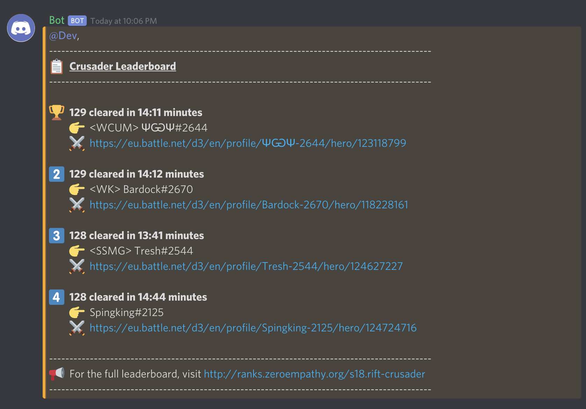

# Diablo 3 Leaderboard Discord Bot

This bot returns the current state of any Diablo 3 single player seasonal leaderboard.

<div>
  
</div>

## Getting Started

Start by cloning this repository.

### Prerequisites

- [Blizzard API credentials](https://develop.battle.net)
- [Discord bot token](https://medium.com/davao-js/2019-tutorial-creating-your-first-simple-discord-bot-47fc836a170b)

### Environment Variables

```env
BOT_TOKEN=
BLIZZARD_CLIENT_ID=
BLIZZARD_CLIENT_SECRET=
CURRENT_SEASON=
```

## Run Command

Project comes pre-compiled inside `/dist`.

```bash
npm start
```

## Using the Bot

- barb
- monk
- crusader
- necro
- wd
- dh
- wizard
- teams

```bash
!lb <leaderboard>
```

## License

[Apache License](./LICENSE)

Maximilien Zaleski © 2018
